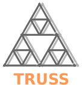
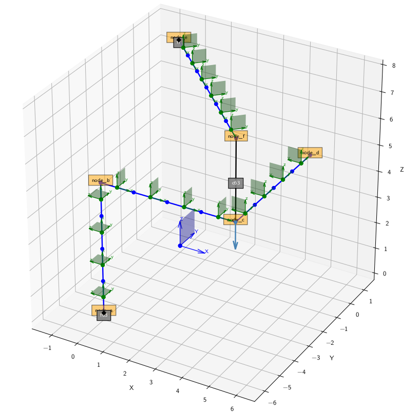

Welcome to |name|'s documentation!
==================================

Introduction
------------

|name_bold| (|name_long|) is a 3D beam FEM_ tool written in Python.

**Features**
    * |eb| beam model in 3D
    * Assembly of complex beam structures
    * Model definition with JSON files or with a model generator library
    * Model generation can be highly automated

.. toctree::
   :maxdepth: 2
   :caption: User guide

   user_guide/what_is
   user_guide/requirements
   user_guide/getting_started
   user_guide/detailed_user_guide
   user_guide/caveats

.. toctree::
   :maxdepth: 1
   :caption: Changelog

   CHANGELOG.md

.. toctree::
   :maxdepth: 1
   :caption: Contributing

   contribute/index

.. toctree::
   :maxdepth: 1
   :caption: Developer documentation

   dev_doc/program_structure
   dev_doc/conventions
   dev_doc/theory
   dev_doc/modules_main

Licence information
-------------------

|name| was developed at `Airinnova AB`_, Stockholm.

:Author:
    |author1|

:Licence:
    |license|
