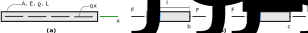
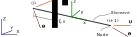
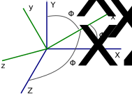
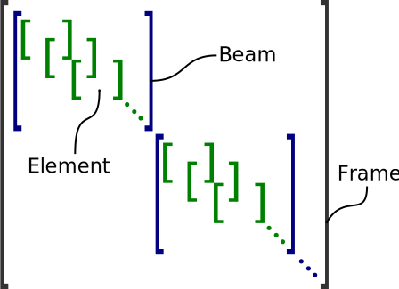
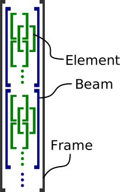

FEM formulation
===============

**TODO** fix references to equations and figures

**TODO** fix alignment of multi-line equations

**TODO** Add missing equations (see input...)

The governing equations **TODO** to **TODO** for the |eb| beam are conveniently solved using a FE formulation which is well suited for computational analyses. The FE discretisation can be constructed from the governing equations using the *Galerkin weighted residual method*. This section summarises the basic idea of the Galerkin method as well as the FE formulation implemented in the structure tool |name|. More detailed theoretical background on the FEM_ can be found in [Cook2002]_, [Przemieniecki1985]_, [Bathe2014]_, [Smith2014]_.

Galerkin weighted residual method
---------------------------------

In the following, the *Galerkin weighted residual method* (henceforth simply called Galerkin method) is outlined. This summary is partly based on [Cook2002]_, [Przemieniecki1985]_ where further details are given. The Galerkin method "converts" the governing differential equations into a discretised problem, eventually formulating a system of linear equations from which an approximate solution can be obtained. In general terms, a physical problem may be stated in the form

.. math::
    :label: eq_galerkin_problem_general

    D u - f = 0

where :math:`D` is a differential operator, :math:`u = u(x)` are dependent variables (e.g. displacements of a material point), :math:`x` are independent variables (e.g. coordinates of a material point) and :math:`f` is a function of :math:`x` (:math:`f` may be constant or zero). Note that the governing equations for the |eb| beam are stated in this form.

The next step in the Galerkin method is to choose an approximating solution :math:`\widetilde{u}` for :math:`u` which does not (have to) satisfy \cref{eq:galerkin_problem_general} in *every* point. Due to the approximation a residual :math:`R = R(x)` may remain. \Cref{eq:galerkin_problem_general} becomes

.. math::
    :label: eq_galerkin_problem_general_residual

    D \widetilde{u} - f = R

Typically, one chooses a polynomial for the approximating function like :math:`\widetilde{u}(x) = a_0 + a_1 \cdot x + a_2 \cdot x^2 \dots`, where the coefficients :math:`a_\text{i}` are chosen so that :math:`R` is small (in some sense). Next, one formulates a so-called *weak form*. The governing equations are no longer required to be satisfied exactly in every point but rather over the integral of a domain :math:`V`, i.e. in an average sense.

.. math::
    :label: eq_galerkin_residual_equation

    \displaystyle\int_V W_\text{i} \cdot R \,\text{d}{V} = 0 \qquad \text{for} \qquad i = 1, 2, \dots, n

The :math:`W_\text{i} = W_\text{i} (x)` are so-called weight functions. In the FEM_ formulation, the :math:`a_\text{i}` are nodal deformations which are usually the primary unknowns as shown in the following example.

Example
~~~~~~~

To illustrate the Galerkin method, the procedure will be shown for a uniform bar in axial loading (\cref{fig:bar_element}a). The equation of motion is

.. math::
    :label: eq_gov_eq_bar_element

    \frac{\partial{}}{\partial{x}} \left( E \cdot A \cdot \frac{\partial{u_x}}{\partial{x}} \right) + q_x - \varrho \cdot A \frac{\partial{}^2 u_x}{\partial{t}^2} = 0

This equation has already been stated in \cref{eq:beam_gov_eq_ux} as part of the beam equations, though without the inertia term which introduces a time dependency ($t$). \Cref{eq:gov_eq_bar_element} is also referred to as the *strong form* of the governing equations, since a solution :math:`u_x(x,t)` has to satisfy the equation in every point :math:`x` and for every point in time :math:`t`. At any arbitrary :math:`x`, the axial force in the bar is

.. math::
    :label: eq_bar_element_Fx

    F_x = A \cdot \sigma_x = E \cdot A \cdot \epsilon_x = E \cdot A \cdot \frac{\partial{}u_x}{\partial{x}}

where :math:`\sigma_x` and :math:`\epsilon_x` are the axial stress and strain, respectively.

.. _fig_bar_element:

   **(a)** 1D bar element under distributed axial loading :math:`q_x = q_x(x)`. **(b)** Two adjacent elements from the discretised bar. After the resulting system of equations is assembled, node *b* is shared (figure adapted from [Cook2002]_ ).

With a separation of variables an approximating solution for \cref{eq:gov_eq_bar_element} of a discretised bar (\cref{fig:bar_element}b) may be formulated in the form

.. math::
    :label: eq_ux_approx

    \widetilde{u}_x(x,t) = \sum_{j=1}^n d_\text{j}(t) \cdot N_\text{j} (x)

where :math:`d_\text{j}` are unknown coefficients (here the nodal displacements), and :math:`N_\text{j}` are referred to as FEM_ *shape functions* which also serve as Galerkin weight functions. The Galerkin residual equation \eqref{eq:galerkin_residual_equation} becomes

.. math::
    :label: eq_galerkin_residual_for_bar

    \displaystyle\int_0^L N_\text{i} \cdot \left[ \sum_{j=1}^n \left( E \cdot A \cdot d_\text{j} \cdot N_\text{j}^\prime \right)' + q_x - \sum_{j=1}^n \varrho \cdot A \cdot \ddot{d}_\text{j} \cdot N_\text{j}  \right] \text{d}{x} = 0

In this case, the domain :math:`V` is the entire bar structure, i.e. the length of the bar :math:`L`. The indices :math:`i` and :math:`j` range over all shape functions (:math:`i, j = 1, 2, \dots, n`). Integrating by parts, rearranging the order of operations and substituting the force :math:`F_x` from \cref{eq:bar_element_Fx} yields

.. math::
    :label: eq_galerkin_residual_for_bar_proc2

    \sum_{j=1}^n \underbrace{ E \cdot A \displaystyle\int_0^L N'_\text{i} \cdot N'_\text{j} \,\text{d}{x} }_{K_{\text{i}\text{j}}} \cdot d_\text{j}
    - \sum_{j=1}^n \underbrace{ \varrho \cdot A \displaystyle\int_0^L N_\text{i} \cdot N_\text{j} \,\text{d}{x} }_{M_{\text{i}\text{j}}} \cdot \ddot{d}_\text{j} \nonumber \\
    = \displaystyle\int_0^L N_\text{i} \cdot q_x \,\text{d}{x} + \left[ N_\text{i} \sum_{j=1}^n F_{x,\text{j}} \right]_0^L

This equation pretty much resembles the sought-after FEM_ formulation. The highlighted terms :math:`K_{\text{i}\text{j}}` and :math:`M_{\text{i}\text{j}}` are elements of the global stiffness matrix :math:`\mathbf{K}` and mass matrix :math:`\mathbf{M}`, respectively. The summation symbolises the assembly process. The result becomes even clearer when choosing shape functions and performing the integrations. For the sake of simplicity, the bar is divided into a single element (:math:`i, j = 1, 2`). As a result of the integration by parts, the second order derivative from \cref{eq:gov_eq_bar_element} disappeared. Therefore, the approximating function :math:`\widetilde{u}_x` can be of lower order than required by the original governing equation \eqref{eq:gov_eq_bar_element}. For a bar it is sufficient to approximate the displacement field using element-wise *linear* functions.

.. math::

    \widetilde{u}_x(x,t) = \mathbf{N}(x) \cdot \mathbf{d}(t) \\
    \quad \text{with} \quad
    \mathbf{N} = \left( N_1, N_2 \right) =
    \left( 1 - \frac{x}{l_e}, \frac{x}{l_e} \right)
    \quad \text{and} \quad
    \mathbf{d} =
    \begin{pmatrix}
        u_1(t)\\
        u_2(t)
    \end{pmatrix} \nonumber

where :math:`x=0` at the left end of the element. The coefficients :math:`u_1` and :math:`u_2` have the same purpose as the :math:`a_\text{i}` mentioned above. Here, they are nodal displacements of the element (notice that :math:`N_\text{i}` is either 0 or 1 at the ends of the element, here :math:`l_e=L`). For a bar made up of a single element, \cref{eq:galerkin_residual_for_bar_proc2} becomes

.. math::
    :label: eq_bar_galerkin_almost_there

    E \cdot A \cdot \displaystyle\int_0^{L} \mathbf{B}^T \cdot \mathbf{B} \,\text{d}{x} \cdot \mathbf{d}
    - \varrho \cdot A \cdot \displaystyle\int_0^{L} \mathbf{N}^T \cdot \mathbf{N} \,\text{d}{x} \cdot \ddot{\mathbf{d}}
    = \displaystyle\int_0^{L} \mathbf{N}^T \cdot q_x \,\text{d}{x}
    + \bigl[ \mathbf{N}^T \cdot F_x \bigr]_0^{L} \\[3mm]

    \text{where} \qquad \mathbf{B} {:=} \mathbf{N}' \nonumber \\[3mm]

    \label{eq:bar_galerkin_more_like_fem}
    \underbrace{
    \frac{E \cdot A}{L} \cdot
    \begin{bmatrix}
        1  & -1 \\
        -1 &  1 \\
    \end{bmatrix}
    }_{\mathbf{K}}
    \underbrace{
    \begin{pmatrix}
        u_1 \\
        u_2 \\
    \end{pmatrix}
    }_{\mathbf{d} = \mathbf{U}}
    +
    \underbrace{
    \frac{-\varrho \cdot A \cdot L}{6} \cdot
    \begin{bmatrix}
        2 & 1 \\
        1 & 2 \\
    \end{bmatrix}
    }_{\mathbf{M}}
    \underbrace{
    \begin{pmatrix}
        \ddot{u}_1 \\
        \ddot{u}_2 \\
    \end{pmatrix}
    }_{\ddot{\mathbf{d}} = \ddot{\mathbf{U}}}
    =
    \underbrace{
    \begin{pmatrix}
        1/2 \\
        1/2
    \end{pmatrix}
    q_x
    +
    \begin{pmatrix}
        F_{x,1} \\
        F_{x,2}
    \end{pmatrix}
    }_{\mathbf{F}}

This is the well known FEM_ formulation, :math:`\mathbf{K} \cdot \mathbf{U} + \mathbf{M} \cdot \ddot{\mathbf{U}} = \mathbf{F}`. The term :math:`\mathbf{K} \cdot \mathbf{U}` represents internal elastic loads, and :math:`\mathbf{M} \cdot \ddot{\mathbf{U}}` represents the inertia loads. The right-hand side represents the external loads :math:`\mathbf{F}`. The second term in :math:`\mathbf{F}` involves the boundary conditions at the left and right end of the bar. The initial governing differential equation is now discretised and transformed into a system of equations.

In general, the discretised formulation is not equal to the exact solution but the FE formulation converges to the exact solution of the mathematical model as the mesh is refined. The rate of convergence is influenced by the choice of the shape functions. A similar procedure as shown for the bar element can be applied to derive the matrices for the *beam* which has additional |dof| for bending and torsion.

The beam element
----------------

As indicated in \cref{sec:structure_general_approach}, beams are divided into *elements* which form the core of the FE formulation. A beam element consists of two nodes, numbered :math:`i` and :math:`i+1` in a global "bookkeeping" system (\cref{fig:element_dof}). It is worth to point out that a 3D beam element is not uniquely defined by two points (nodes) in space. As the element contains directional information, namely bending stiffness :math:`E \cdot I_y` and :math:`E \cdot I_z` defined in a local (cross section) coordinate system, such a local system has to be defined as part of the user input. The orientation of the local coordinate system may be provided as an "upwards" direction (:math:`z`-direction), or using angles with respect to the global coordinate system.

.. _fig_beam_element:

   Beam element with translational and rotational |dof_long|. The global coordinate system is indicated in blue and the element-local coordinate system (located in the element centre) in green. In the global structure system (including all elements) the nodes have numbers :math:`i` and :math:`i+\text{i}`. Within an element these nodes are numbered 1 and 2.

Each beam element has six translational and six rotational |dof|. These may be summarised in an *element displacement vector*,

**TODO** {\input{contents/maths/fem/element_displacement_vector.tex}}%

where the subscript *e* indicates the *element* and *loc* the formulation with respect to the *local* system. The deformation in between two nodes is given by *shape functions* as :math:`\mathbf{U}_{\text{e},\xi} = (u_x, u_y, u_z, \Theta_x, \Theta_y, \Theta_z)_{\text{e},\xi}^T = \mathbf{N} \cdot \mathbf{U}_\text{e, loc}`. The shape function matrix :math:`\mathbf{N}` for the \EulerBernoulli beam is (c.f. [Cook2002]_)

**TODO** {\input{contents/maths/fem/shape_functions.tex} }

.. math::

    \text{with} \quad \xi := \frac{\bar{x}}{l_e} \qquad \text{where} \quad \bar{x} := \frac{l_e}{2} + x

The variable :math:`\xi` is a relative element coordinate. At the "left" element node :math:`\xi` is zero and at the "right" node :math:`\xi` is one (see \cref{fig:element_dof}). The last two rows in the shape function matrix are used to describe :math:`\Theta_y(\xi)` and :math:`\Theta_z(\xi)` which are related through the kinematic relations stated in \cref{eq:angles_euler_bernoulli} (see p.\,\pageref{eq:angles_euler_bernoulli}).

The *element stiffness matrix* is (c.f. [Cook2002]_, [Przemieniecki1985]_)

**TODO** {\input{contents/maths/fem/element_stiffness_matrix.tex}}

The stiffness matrix for a *Timoshenko beam element* which accounts for shear deformations can be found in [Cook2002]_, [Przemieniecki1985]_.

Assuming that the mass is concentrated on the *elastic axis*, the consistent *element mass matrix* is (c.f. [Przemieniecki1985]_)

**TODO** {\input{contents/maths/fem/element_mass_matrix.tex}}

where :math:`I_x` denotes the polar moment of inertia. The effect of shear deformations can be accounted for in the mass matrix which is shown by Przemieniecki [Przemieniecki1985]_. Additional *point masses* can be lumped into specific nodes. Consider two masses, :math:`m_1` and :math:`m_2`, assigned to nodes 1 and 2 of an element, respectively. Disregarding rotational inertia, the *element point mass matrix* becomes

**TODO** {\footnotesize \input{contents/maths/fem/element_pointmass_matrix.tex}}

where the zero matrices are of size :math:`3 \times 3`. The final element mass matrix is given as the sum :math:`\mathbf{M}_\text{e,loc} = \mathbf{M}_\text{e,dist,loc} + \mathbf{M}_\text{e,point,loc}`.

Generally, loads may be formulated as being concentrated on a specific node or as being distributed over the length of the element. Distributed loads will eventually be translated into equivalent (concentrated) nodal loads as a result of the Galerkin method. Thus, the load :math:`\mathbf{f}_\text{e,loc}` acting on an element can be written as a sum of concentrated loads :math:`\mathbf{f}_\text{e,conc,loc}` and distributed loads :math:`\mathbf{f}_\text{e,dist,loc}`, forming the *element load vector* (c.f. [Andersen2008]_).

**TODO** {\footnotesize \input{contents/maths/fem/element_load_vector.tex}}

The distributed loads (:math:`q_x`, :math:`q_y`, :math:`q_z`, :math:`m_x`, :math:`m_y` and :math:`m_z` as defined in \cref{sec:theory_structural_modelling}) are assumed to be *constant* over the length of the element. Therefore, it may be necessary to use a finer discretisation if varying distributed loads are to be modelled accurately.

Transformation into the global system
~~~~~~~~~~~~~~~~~~~~~~~~~~~~~~~~~~~~~

So far, the element tensors have been formulated in the element *local* coordinate system. In order to assemble a global system of equations reflecting the full structure it is first necessary to transform the element tensors using a transformation matrix :math:`\mathbf{T}`, given as (c.f. [Cook2002]_, [Young2012]_)

**TODO** {\input{contents/maths/fem/element_transformation_matrix.tex}}

and where :math:`l_\text{i}`, :math:`m_\text{i}` and :math:`n_\text{i}` (:math:`i = x, y, z`) are direction cosines defined by

.. math::
    :label: eq_lmn_direction_cosines

    \begin{matrix}
        l_x = \cos \Phi_\text{xX}, & \quad & m_x = \cos \Phi_\text{xY}, & \quad & n_x = \cos \Phi_\text{xZ} \\
        l_y = \cos \Phi_\text{yX}, & \quad & m_y = \cos \Phi_\text{yY}, & \quad & n_y = \cos \Phi_\text{yZ} \\
        l_z = \cos \Phi_\text{zX}, & \quad & m_z = \cos \Phi_\text{zY}, & \quad & n_z = \cos \Phi_\text{zZ}
    \end{matrix}

where :math:`\Phi_{\text{i}\text{j}}` is the angle between a local axis :math:`i` and a global axis :math:`j` (:math:`i = x, y, z` and :math:`j = X, Y, Z`) as illustrated in \cref{fig:direction_cosines}.

.. _fig_dir_cosines:

   The orientation of the local :math:`x`-axis with respect to the global coordinate system is defined by angles :math:`\Phi_\text{xX}`, :math:`\Phi_\text{xY}` and :math:`\Phi_\text{xZ}` (modified from [Young2012]_)

Using the transformation matrix, the *element* stiffness-, mass- and load tensors can be transformed into the *global* coordinate system (subscript *glob*).

.. math::

    \mathbf{K}_\text{e,glob} &= \mathbf{T}^T \cdot \mathbf{K}_\text{e,loc} \cdot \mathbf{T} \\
    \mathbf{M}_\text{e,glob} &= \mathbf{T}^T \cdot \mathbf{M}_\text{e,loc} \cdot \mathbf{T} \\
    \mathbf{f}_\text{e,glob} &= \mathbf{T}^T \cdot \mathbf{f}_\text{e,loc}

Assembly of the global system of equations
~~~~~~~~~~~~~~~~~~~~~~~~~~~~~~~~~~~~~~~~~~

The entire structure system can finally be *assembled* into a system of equations, now consistently formulated with respect to the global coordinate system. As described in \cref{sec:structure_general_approach}, a full structure (here referred to as frame) is made up of individual beams (substructures). \Cref{fig:matrix_vector_assembly} illustrates how the *global stiffness matrix* :math:`\mathbf{K}`, the *global mass matrix* :math:`\mathbf{M}` and the *global load vector* :math:`\mathbf{F}` are assembled based on the transformed element matrices, \cref{eq:element_stiffness_matrix_glob,eq:element_mass_matrix_glob,eq:element_load_vector_global_glob}.

.. _fig_matrix_assembly:

   Matrix assembly

.. _fig_vector_assembly:

   Vector assembly

Assembly of global tensors. The element matrices and vectors are of size :math:`12 \times 12` and :math:`12 \times 1`, respectively. Potential connections between individual beams (e.g. rigid connections) are defined separately through boundary conditions.

A static equilibrium is described by

.. math::
    :label: eq_fem_static_with_gravity

    \mathbf{K} \cdot \mathbf{U} = \mathbf{F} + \mathbf{F}_\text{accel} \qquad \text{with} \quad \mathbf{F}_\text{accel} := \mathbf{M} \cdot \mathbf{A}

where :math:`\mathbf{U}` is the *global vector of nodal deformations* (nodal deformations with respect to the global system). The additional term :math:`\mathbf{F}_\text{accel}` allows to take loads due to gravity or due to quasi-steady flight manoeuvres into account, when the acceleration is known (inertia relief method [Wijker2004]_). The (translational) acceleration vector is

.. math::
    :label: eq_accel_vector

    \mathbf{A} = \left( a_x, a_y, a_z, 0, 0, 0, a_x, a_y, a_z, 0, 0, 0, \dots \right)^T

where :math:`a_x`, :math:`a_y` and :math:`a_z` are accelerations in :math:`X`-, :math:`Y`- and :math:`Z`-directions of the global coordinate system. Gravity in :math:`Z`-direction, for instance, can be modelled by setting :math:`a_x = a_y = 0` and :math:`a_z = -g` with :math:`g` being the gravitational acceleration. By performing the multiplication :math:`\mathbf{M} \cdot \mathbf{A}` it can be shown that the weight of each element is modelled as a constant distributed load, and analogous to \cref{eq:element_load_vector}, divided between the two nodes of the element.

Boundary conditions
~~~~~~~~~~~~~~~~~~~

\Cref{eq:fem_static_with_gravity} is to be solved for the global vector of nodal deformations :math:`\mathbf{U}`. Without fixing the structure in space, :math:`\mathbf{K}` is singular and the system of equations cannot be uniquely solved. To find a unique solution, boundary conditions have to be applied. Linear constraints imposed on the structure can be formulated as :math:`\mathbf{B} \cdot \mathbf{U} = \mathbf{b}` where the matrix :math:`\mathbf{B}` and the vector :math:`\mathbf{b}` contain constants. This formulation can be used to impose both *single point constraints* (e.g. setting single |dof| to known values, often zero) as well as *multipoint constraints* (e.g. a rigid connector between two nodes) [Cook2002]_. As shown in [Cook2002]_, Lagrange's method of undetermined multipliers can be used to formulate a system of equations for the structure including the applied boundary conditions.

.. math::
    :label: eq_static_analysis

    \begin{bmatrix}
        \mathbf{K} & \mathbf{B} \\
        \mathbf{B}^T & \mathbf{0}
    \end{bmatrix}
    \cdot
    \begin{pmatrix}
        \mathbf{U} \\
        \boldsymbol{\lambda}
    \end{pmatrix}
    =
    \begin{pmatrix}
        \mathbf{F} + \mathbf{F}_\text{accel} \\
        \mathbf{0}
    \end{pmatrix}

Here, :math:`\boldsymbol{\lambda}` is a vector with the Lagrange multipliers of length equal to the number of linear constraints. \Cref{eq:static_analysis} is solved for :math:`\mathbf{U}` and :math:`\boldsymbol{\lambda}`, where the Lagrange multipliers may be interpreted as forces of constraint [Cook2002]_.

.. note::

    This summary is based on/copied from [Dettmann2019]_ with the authors permission.
