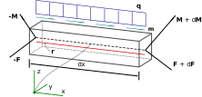

.. _sec_theory:

Introduction
============

Euler-Bernoulli beam theory
---------------------------

*Euler-Bernoulli beam theory*, also known as classical beam theory, makes use of significant simplifications and assumptions. Most notably, it imposes several constraints on representable deformations of the beam structure. It is assumed that the cross section is infinitely rigid in its own plane, and that -- after deformation -- the cross section remains plane and normal to the deformed beam axis (fundamental Euler-Bernoulli assumptions) [BaCr09]_. As a consequence, shear deformations cannot be resolved. In addition, warping deformations are neglected. Furthermore, small deformations are assumed. This allows the linearisation of the governing differential equations. Isotropic material is assumed, and the relation between stresses and strains is modelled using Hooke's law, i.e. using a linear-elastic relation. For materials relevant in aircraft manufacturing such as fibre composites or aluminium this assumption implies a restriction to small strains. The governing equations applied in this work have been derived from an equilibrium consideration in the undeformed state. In particular, this implies that normal forces do not contribute to any bending loads. Thus, global buckling phenomena cannot be represented with these equations. A more extensive overview and discussion about explicit and implicit assumptions can be found in [AnNi08]_, [BaCr09]_.

.. _fig_beam_element_in_equilibrium:

   Undeformed beam element in equilibrium. All loads are thought to act on the elastic axis (dashed line). The tilde symbols indicates internal loads rather than externally applied loads.

The Euler-Bernoulli beam model is well covered in literature (see for instance [AnNi08]_, [BaCr09]_, [Megs16]_, [YoBS12]_), thus only a brief overview will be given here. The governing equations can be derived from the equilibrium state of an infinitesimal beam element with length :math:`\text{d}x` in its undeformed state (:numref:`fig_beam_element_in_equilibrium`). The internal loads, the force :math:`\mathbf{\widetilde{F}}` and the moment :math:`\mathbf{\widetilde{M}}`, may differ between the left and right cut. Externally applied distributed forces :math:`\mathbf{q}` (dimension force per length) and distributed moments :math:`\mathbf{m}` (dimension moment per length) are assumed to be constant over the beam element length :math:`\text{d}x`. The force equilibrium stated in the local coordinate system yields

.. math::
    :label: beam_force_equilibrium

    -\mathbf{\widetilde{F}} + \left( \mathbf{\widetilde{F}} + \text{d}\mathbf{\widetilde{F}} \right) + \mathbf{q} \cdot \text{d}{x} = \mathbf{0}
    \quad \Rightarrow \quad
    \frac{\text{d}}{\text{d}{x}}
    %%
    \begin{pmatrix}
        \widetilde{F}_x \\
        \widetilde{F}_y \\
        \widetilde{F}_z
    \end{pmatrix}
    +
    \begin{pmatrix}
        q_x \\
        q_y \\
        q_z
    \end{pmatrix}
    = \mathbf{0}

where :math:`\widetilde{F}_x` is the axial force component, :math:`\widetilde{F}_y` and :math:`\widetilde{F}_z` are shear force components. The moment equilibrium yields

.. math::
    :label: beam_moment_equilibrium

    -\mathbf{\widetilde{M}} + \left( \mathbf{\widetilde{M}} + \text{d}{\mathbf{\widetilde{M}}} \right) + \mathbf{m} \cdot \text{d}{x} - \mathbf{r} \times \mathbf{\widetilde{F}} + \frac{\mathbf{r}}{2} \times \mathbf{q} \cdot \text{d}{x} = \mathbf{0}

where :math:`\mathbf{r} = (-\text{d}{x}, 0, 0)^T` is the lever arm for the force contributions. As the term :math:`\mathbf{r} \cdot \text{d}{x}` is small of higher order, the moment contribution from the distributed force is henceforth neglected. The shear forces :math:`\widetilde{F}_y` and :math:`\widetilde{F}_z` in eq. :eq:`beam_moment_equilibrium` can be eliminated after a derivation of eq. :eq:`beam_moment_equilibrium` by :math:`x` and a substitution of the shear loads using eq. :eq:`beam_force_equilibrium`.

.. math::

    \frac{\text{d}}{\text{d}{x}}%
    \begin{pmatrix}
        \widetilde{M}_x \\
        \widetilde{M}_y \\
        \widetilde{M}_z
    \end{pmatrix}
    +
    \begin{pmatrix}
        m_x \\
        m_y \\
        m_z
    \end{pmatrix}
    +
    \begin{pmatrix}
        0 \\
        -\widetilde{F}_z \\
        \widetilde{F}_y
    \end{pmatrix}
    &= \mathbf{0} \\
    %%
    %%
    %%
    \Rightarrow %
    \frac{\text{d}^2}{\text{d}{x}^2}
    %%
    \begin{pmatrix}
        \widetilde{M}_x \\
        \widetilde{M}_y \\
        \widetilde{M}_z
    \end{pmatrix}
    +
    \frac{\text{d}}{\text{d}{x}}
    %%
    \begin{pmatrix}
        m_x \\
        m_y \\
        m_z
    \end{pmatrix}
    +
    \begin{pmatrix}
        0 \\
        q_z \\
        -q_y
    \end{pmatrix}
    &= \mathbf{0}

The internal loads :math:`\mathbf{\widetilde{F}}` and :math:`\mathbf{\widetilde{M}}` may also be formulated as integrals of stresses over the cross section area. Using kinematic relations based on the geometry of the deformed beam, normal and shear strains can be derived. As mentioned above, stresses and strains are connected using Hooke's law. Together, these equations can be written as a system of linear fourth order differential equations [#]_.

.. [#] A more elaborate derivation of the governing equations can be found in [AnNi08]_, [BaCr09]_.

.. math::
    :label: u_x

    \frac{\text{d}}{\text{d}{x}} \left( E \cdot A \cdot \frac{\text{d}{u_x}}{\text{d}{x}} \right) + q_x = 0

.. math::
    :label: u_y

    \frac{\text{d}^2}{\text{d}{x}^2} \left( E \cdot I_z \cdot \frac{\text{d}^2 u_y}{\text{d}{x}^2} \right) +\frac{\text{d}{m_z}}{\text{d}{x}} -q_y = 0

.. math::
    :label: u_z

    \frac{\text{d}^2}{\text{d}{x}^2} \left( E \cdot I_y \cdot \frac{\text{d}^2 u_z}{\text{d}{x}^2} \right) -\frac{\text{d}{m_y}}{\text{d}{x}} -q_z = 0

.. math::
    :label: t_x

    \frac{\text{d}}{\text{d}{x}} \left( G \cdot J \cdot \frac{\text{d}{\Theta_x}}{\text{d}{x}} \right) + m_x = 0

The beam stiffness is described by both geometry and material parameters. The beam cross section area :math:`A`, the second moments of area about the local :math:`y`- and :math:`z`-axes, denoted :math:`I_y` and :math:`I_z`, as well as the torsion constant :math:`J` are defined by the local cross section geometry. The *Young's modulus* :math:`E` and the shear modulus :math:`G` are material properties. The beam deformation is described by displacements :math:`u_x`, :math:`u_y` and :math:`u_z`, and by rotations :math:`\Theta_x`, :math:`\Theta_y` and :math:`\Theta_z`, where the subscripts :math:`x`, :math:`y` and :math:`z` refer to the local coordinate system. Equations :eq:`u_x` to :eq:`t_x` are fully *uncoupled* differential equations which is a result of the simplifying assumptions mentioned above. In the preceding development it was also assumed that the :math:`y`- and :math:`z`-axes are principal centroidal axes of the cross section. This implies that the bending about the :math:`y`- and :math:`z`-axes is uncoupled (no skew bending).

It is further noted that rotations :math:`\Theta_y` and :math:`\Theta_z`, assuming small-angle approximations, are related through basic kinematic relations.

.. math::
    :label: eq_angles_euler_bernoulli

    \Theta_y = - \frac{\text{d}{u_z}}{\text{d}{x}}
    %%
    \quad \text{and} \qquad
    %%
    \Theta_z = \frac{\text{d}{u_y}}{\text{d}{x}}

Practically, the governing equations are solved using a FE formulation which is well suited for computational analyses. Details on the matrix formulation are covered in :ref:`sec_fem_formulation`.

.. note::

    This summary is based on/copied from [Dett19]_ with the authors permission.
