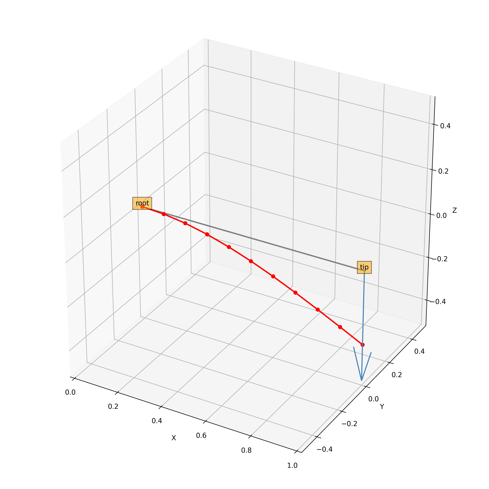
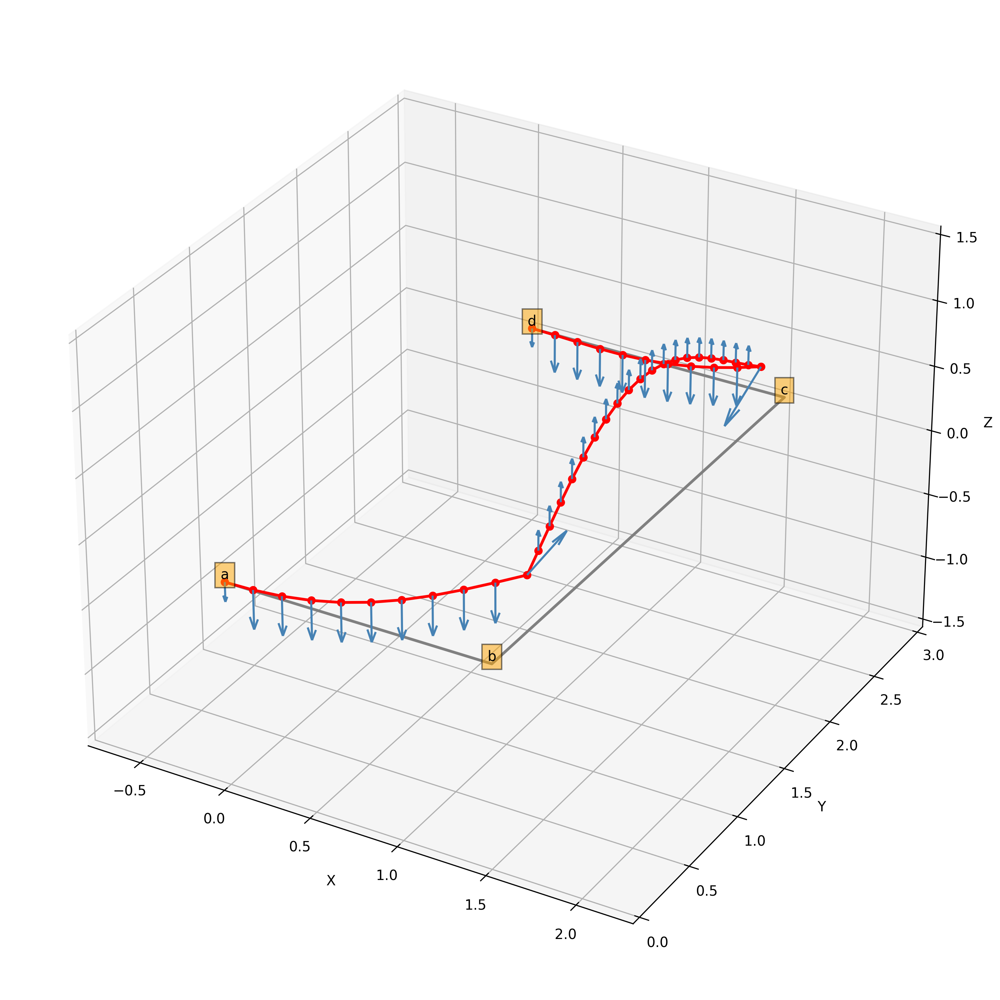

.. _sec_getting_started:

Getting started
===============

This page briefly explains how to get started with |name|. The goal is to give you a basic understanding of how |name| works and how analyses can be set up and run. We also explain how to fetch result data which may be of interest to you. Please note that the model interface and all available model and result parameters are explained in more detail on the following pages.

Python API
----------

|name| provides a pure Python interface which allows you to set up a beam model in a simple Python script. Therefore, some some basic Python knowledge is assumed, but no advanced skills are needed.

Built-in models
---------------

|name| includes a number of built-in models. The simplest model is a single cantilever beam loaded with a point load at the free end. First, create a Python script (or download the script from the link below) and run it with ``python example_cantilever.py``.

.. literalinclude:: ../../../tests/integration/getting_started_models/example_cantilever.py
    :language: python

**Download the script:** `example_cantilever.py <https://raw.githubusercontent.com/airinnova/framat/master/tests/integration/getting_started_models/example_cantilever.py>`_

When running the script from a terminal you should see a few log entries providing feedback about the program status, and an interactive plot should be created displaying the beam model.

   Simple built-in cantilever model

This example is, admittedly, not the most exciting model, but it allows you to easily check that |name| has been installed correctly on your system and works. Note that you can try to run some other (more exciting) built-in models. Just replace ``'cantilever'`` with one of the following strings.

.. include:: ../builtin_models.txt

Building your own model
-----------------------

Let's now explore a few more options to give you an overview of how to actually set up you own model.

**TODO**

.. literalinclude:: ../../../tests/integration/getting_started_models/example_model2.py
    :language: python

**Download the script:** `example_model2.py <https://raw.githubusercontent.com/airinnova/framat/master/tests/integration/getting_started_models/example_model2.py>`_

   Example model

**TODO**

Fetching result data
--------------------

**TODO**
